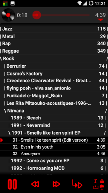
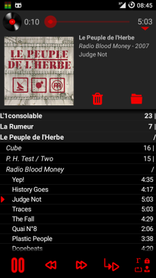
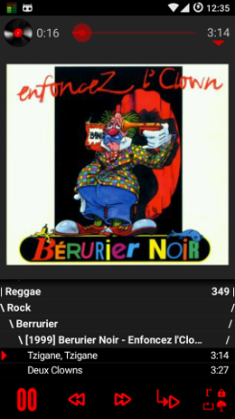

## SicMu Player for Android

Every songs of the phone are put in a unique big song list.

Songs are sorted and grouped by folders, artists, albums and album's track.

Works on old slow small devices (from Android froyo 2.2).

4.3" screen:

&nbsp;

[Video (outdated)](http://youtu.be/LGyjDfwimzA)

[More screenshots](Screenshots.md)

### Installation

### Detailed features

- sort mode:
    - sort by folder tree, useful for big music list (default)
    - sort by artists, albums and track number
    - sort by folders, artists, albums and track number, flattening folder hierarchy
- cover art image
- songs navigation:
    - repeat mode (all, group, one track)
    - shuffle mode
    - seek bar
    - auto repeat seek buttons
    - shake the phone to go to next song
- User Interface:
    - notification with media controls
    - disable / enable lockscreen
    - configurable font size
- bluetooth & scrobble
    - bluetooth support (play through bluetooth device)
    - media buttons support (next, prev, play/pause) from external device (bluetooth headphones...)
    - support [Simple Last.fm Scrobbler](https://github.com/tgwizard/sls) or [Scrobble Droid](https://code.google.com/p/scrobbledroid) (disabled by default in settings)
- play mp3, ogg, flac, midi, wav, 3gp... see android mediaplayer supported media formats (depends on android version).
- light and fast: starts in 0.5s and uses 10Mo of RAM with 5Go of music (1000 files, 100 folders) on a 700MHz ARM processor.

### Help

- see help section in app's settings

### Todo (perhaps :-)

- rate songs and filter by rating
- remove file
- browse folder
- block song/folder
- group by genre?
- search?
- pinned section (upper group level stay at top until another one appears)?
- mp3 tag editor ?
- playlist?
- audioeffect/equalizer

Detailed todo list available in [TODO.txt](misc/TODO.txt).

### Credits

Lot's of time saved thanks to Sue Smith's [tutorials on creating a Music Player on Android](http://code.tutsplus.com/tutorials/create-a-music-player-on-android-project-setup--mobile-22764).

Use some icons done by Daniele De Santis (Creative Commons Attribution 3.0 Unported), found on iconfinder.com.

Seekbar style created by Jérôme Van Der Linden (Creative Commons Attribution 3.0 Unported), found on http://android-holo-colors.com.

RepeatingImageButton.java and MediaButtonIntentReceiver.java file mostly copied from official android music player (Apache License, Version 2.0).

### Developer

Compiled with Android Studio.
Tested on Kitkat (4.4.4), Samsung S3 (7.1), Android 11...

Feel free to add GitLab issues (feature request, bugs...).
If you need a feature that is in the todolist, open a feature request on gitlab to speed up its development.

A UML class diagram describe a bit the architecture for people that would want to develop the software [UmlClass.png](misc/UmlClass.png).

SicMu player pronounced zicmu. S is for Super Simple Sorted Souch player.

### Donation

If you don't know what to do with your money or want to make me smile the whole day:
[donate](http://rodolphe.souchaud.free.fr/donate)

### License

SicMu Player is licensed under the GPLv3. See file [LICENSE](LICENSE) for more details.

