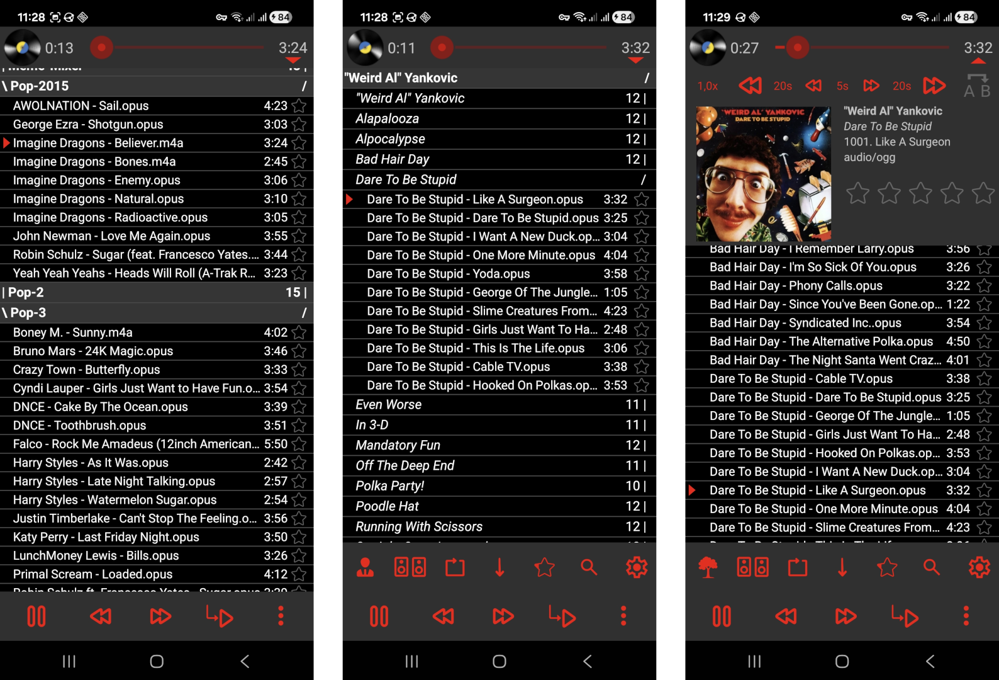

# SicMu Neo

This is a fork of [Mathieu Souchaud's SicMu alias SMP](https://gitlab.com/souch/SMP).

SicMu Neo is a file-based music player with a very basic UI. You can use your folder hierarchy to group and organize music, or you can use the audio file metadata to group the music by artist and album. It supports a wide range of playback options, and includes support for Last.FM scrobbling via third-party apps.

### Screenshots

### Upstream Changes
This fork retains the spirit of the original app and adds these features:
- Search
- Advanced album art loading (You have an Album.jpg file? It will be considered.)
- Per-audio-device mono/stereo settings
- Radio shuffle mode (Random song order, starts first song selected at random point in the song)
- "Search on genius.com" button when long-pressing on audio file
- Changed the audio backend to the modern ExoPlayer, causing less RAM usage (220MB prior vs 135MB now)

The original SicMu is better suited for old devices (Android 4.0+). This fork uses more modern features and requires at least Android 7.0.

<!--
### Installation

These are links for the original SicMu Player:

-->

### License and Credits

SicMu Player is licensed under the GPLv3 only. See file [LICENSE](LICENSE) for more details.

- Original app by [Mathieu Souchaud](https://gitlab.com/souch/SMP) [(Donate)](https://www.paypal.com/donate/?hosted_button_id=QAPVFX7NZ8BTE).
- Thanks to Sue Smith for [tutorials on creating a Music Player on Android](http://code.tutsplus.com/tutorials/create-a-music-player-on-android-project-setup--mobile-22764).
- Icons from Daniele De Santis / iconfinder.com (Creative Commons Attribution 3.0 Unported)
- Icons from Google Material Symbols (Apache 2.0)
- Seekbar style by [Jérôme Van Der Linden](https://android-holo-colors.com)
- JAudioTagger hard-forked, copied from various sources, released under LGPL 2.1 [[1]](https://github.com/Shabinder/jaudiotaggerAndroid) [[2]](https://github.com/Kaned1as/jaudiotagger) [[3]](https://www.jthink.net/jaudiotagger/)